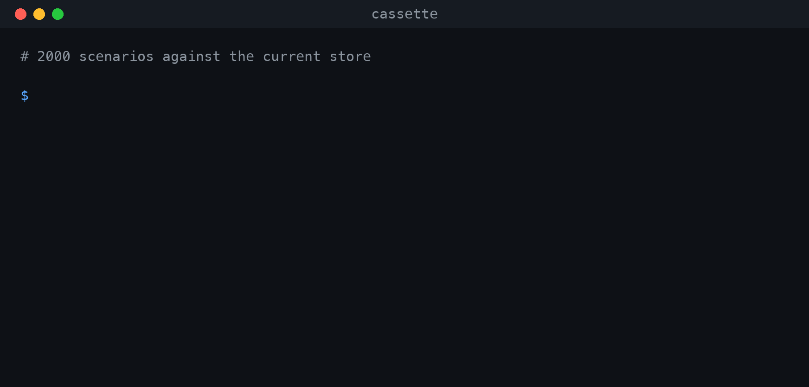
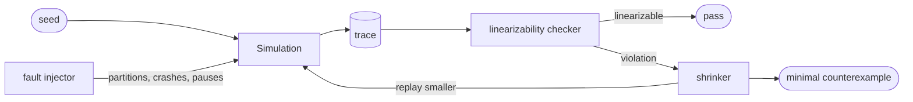

# Cassette

**Deterministic simulation testing for distributed systems — every bug reproduces, every time.**

[](https://github.com/ibrahimadlani/cassette/actions/workflows/ci.yml)
[](https://github.com/ibrahimadlani/cassette/actions/workflows/fuzz.yml)
[](https://github.com/ibrahimadlani/cassette/actions/workflows/pages.yml)
[](https://codecov.io/gh/ibrahimadlani/cassette)
[](LICENSE)



**▶ [Try it live — step through the bug in your browser](https://ibrahimadlani.github.io/cassette/?trace=minimal-violation)**

## The problem

A distributed system fails in the interleavings you did not think of. Those
failures are rare, and the rare ones are the dangerous ones.

They are also nearly impossible to reproduce, because the thing that chose the
interleaving — the OS scheduler, the network, the clock — is not under your
control and does not take instructions. So the usual approach is to run the same
test a thousand times and hope to hit the window twice.

Cassette takes control of the interleaving instead.

## How it works

The system under test never touches a socket and never reads the wall clock. It
talks to an `Env` handed to it by a single-threaded discrete-event simulator
that decides — from one integer seed — which message is delivered, in which
order, which is lost, which node crashes, and whose clock drifts.



A seed therefore describes a run completely. Find a failure once and you can
replay it exactly, as many times as you like — which is what makes the last two
boxes possible at all. This is the approach FoundationDB, TigerBeetle and
Antithesis take.

## Results

Measured by [`make bench`](scripts/benchmark.py) on an 8-core M-series laptop.
Every number here comes out of that script; none of them is estimated.

| Metric | Value |
|---|---|
| Scenarios explored per second | **930** (8 workers) |
| Simulated cluster time per real second | **7 hours** idle, **13 minutes** under load |
| Consistency bugs found in my own implementation | **2 fixed, 1 unfixable by design** |
| Median shrink ratio | **10.1×** (488 events → 48, 24 operations → 4) |
| Seeds in the regression corpus | **14** |
| Determinism check | 1 000 seeds × 2 runs, hashes compared, **6.4 s** |
| Tests · coverage | 475 · **92 %** |

## A bug it found

Fourteen of the first two thousand seeds returned a value that no correct
key-value store could have returned. The shrinker reduced every one of them to
the same four operations, on three replicas, **with no injected faults at
all** — no loss, no partition, no crash:

```
1. client A writes x=1    via n2   -> ok
2. client B writes x=2    via n2   -> ok
3. client B reads  x      via n0   -> 2   <-- no legal order can explain this
4. client A reads  x      via n1   -> 1
```

Both writes go through the same coordinator. Both rounds read the quorum before
either writes, so both compute the same successor version for different values.
Replicas keep the first stamp and reject the second — while still acknowledging
it. The losing write is reported successful and lands on half the cluster.

The `(counter, node_id)` version tiebreak I was so pleased with only ever
distinguished *different* coordinators. It did nothing about one coordinator
racing itself, which is the case that actually happens.

Fixing that left three violations, which turned out to be the missing write-back
on the read path — the second phase of the ABD register construction. Both are
written up in **[docs/FINDINGS.md](docs/FINDINGS.md)**, along with a third that
cannot be fixed here at all.

Both fixed defects stay reachable behind `--buggy`, so the claim is runnable
rather than asserted:

| | scenarios | wall time | violations |
|---|---|---|---|
| `--buggy` | 7 | 0.24 s | 1 |
| fixed | 20 000 | 21.5 s | 0 |

## Quickstart

```bash
git clone https://github.com/ibrahimadlani/cassette && cd cassette
make install
make demo
```

`make demo` runs the whole story: two thousand scenarios against the current
store, the same fuzzer finding a violation in seven with the defects switched
back on, and the shrinker reducing it to the four lines above.

## The determinism contract

Inside `cassette/sim/` and `cassette/kv/` there is no `time.time()`, no global
`random`, no `uuid4()`, no threads and no I/O. A node's only door to the outside
world is the `Env` it is handed.

Three independent mechanisms enforce it:

1. **A lint rule.** `ruff` bans the modules outright, so it fails in the editor
   rather than in the test run.
2. **An AST guard.** A test parses every file in the two core packages and
   rejects a banned import or builtin. Its allowlist has one entry —
   `sim/rng.py` may import `random`, because wrapping it is that module's whole
   job — and another test asserts the allowlist stays that short.
3. **The trace hash.** A thousand seeds, run twice each, compared by the SHA-256
   of their canonical trace. This is the only check that can catch a leak nobody
   thought to ban, and it is deliberately the crudest assertion in the
   repository.

A CI job repeats the whole suite under a randomised `PYTHONHASHSEED`.

The full contract — and the two decisions behind it that look like details and
are not — is in **[docs/DETERMINISM.md](docs/DETERMINISM.md)**.

## Architecture

```
cassette/
├── sim/        the simulator — knows nothing about key-value stores
├── kv/         the system under test — knows nothing about the simulator
├── checker/    the oracle — knows only about histories
├── shrink/     reduction — knows how to re-run a scenario, not what it means
└── cli/        the only layer allowed to touch the outside world
web/            the replayer — reads traces, never runs the simulator
```

`kv/` depends on `sim.env` and `sim.types` and on nothing else in `sim`. It
cannot reach the scheduler, the clock, the network or the random source, because
they were never handed to it. That is not a convention; it is the reason the
project works.

- [DESIGN.md](docs/DESIGN.md) — how the pieces fit
- [DETERMINISM.md](docs/DETERMINISM.md) — the contract and its enforcement
- [FAULTS.md](docs/FAULTS.md) — what the simulator is allowed to do
- [FINDINGS.md](docs/FINDINGS.md) — the bugs, reduced
- [adr/](docs/adr/) — six architecture decisions, with the alternatives that lost

## Non-goals

- **Not a database.** Nothing here should go near production data.
- **Not a performance model.** It reproduces orderings, not thread contention,
  syscall latency or kernel behaviour. The throughput figures describe this
  simulator, not any real cluster.
- **Not a consensus implementation.** The store is a leaderless quorum register.
  That was deliberate — [ADR-0003](docs/adr/0003-quorum-kv-as-first-system-under-test.md)
  explains why it beat Raft as a first subject — and it is also why
  compare-and-swap cannot be made linearizable here.
- **No "break it yourself" mode** in the demo. The replayer reads pre-generated
  traces; running the simulator in a browser was on the cut list from day one
  ([ADR-0005](docs/adr/0005-pregenerated-traces-for-the-web-replayer.md)).

## What I would do next

**Store reduced scenarios, not seeds.** The corpus records seeds, so a change to
the simulator invalidates the whole file — which happened once already, when the
fault injector was given its own random stream. A shrunk scenario carries its
operations and faults explicitly and would survive that. The shrinker already
produces exactly the right object.

**A Raft backend.** Not for its own sake: compare-and-swap is a consensus
problem in disguise and cannot be made linearizable on a quorum register at any
quorum size. Raft is the specific thing that would fix the specific finding in
`FINDINGS.md`, and the simulator would not need a line changed — a new package
implementing the same `Node` protocol is the whole job.

**A smarter shrinker.** Deletion alone stalls at about 2×, because the predicate
is not monotone: removing an operation changes every latency draw after it.
Shrinking the *random choices* rather than the scenario, the way Hypothesis
does, would make reductions derive from the original run rather than merely
resemble it.

## Licence

MIT.
