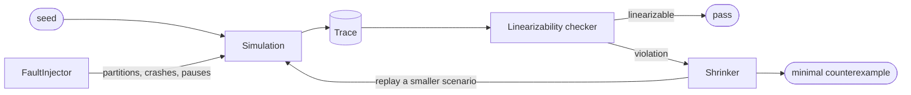

# Design

How the pieces fit, and why they are arranged this way.

## The shape of a run



A run starts from an integer. The simulation turns it into an ordered sequence
of events; the recorder turns those into a trace; the checker turns the trace
into a verdict. If the verdict is a violation, the shrinker replays the same
scenario over and over with pieces removed until what is left is small enough
to read.

Every arrow in that diagram is pure with respect to the seed. Nothing consults
the wall clock, the filesystem or a second thread.

## Layers

```
cassette/
├── sim/       the simulator. Knows nothing about key-value stores.
├── kv/        the system under test. Knows nothing about the simulator.
├── checker/   the oracle. Knows only about histories.
├── shrink/    reduction. Knows how to re-run a scenario, not what it means.
└── cli/       the only layer allowed to touch the outside world.
```

The dependency arrows all point the same way: `kv` depends on `sim.env` and
`sim.types`, and on nothing else in `sim`. It cannot reach the scheduler, the
clock, the network or the random source, because they were never handed to it.

That is not a convention. It is the reason the project works.

## Env, and why it is the whole design

```python
class Env(Protocol):
    def now(self) -> int: ...
    def send(self, to: NodeId, msg: Payload) -> None: ...
    def set_timer(self, delay_ms: int, tag: str) -> None: ...
    def cancel_timer(self, tag: str) -> None: ...
    def random(self) -> float: ...
```

Five methods. A replica gets one of these and has no other way to affect
anything. It cannot read the clock, because there is no clock to read — `now()`
returns what the simulation decided this node believes. It cannot open a
socket. It cannot start a thread.

Testability is usually described as something you add to a system: mocks,
seams, dependency injection retrofitted around code that was written without
them. Here it is the first decision, and everything else follows from it. The
same replica code could run over real sockets by swapping the `Env`, and not a
line of `kv/` would change.

## The event loop

One priority queue, ordered by `(time_ms, seq)`.

`seq` is a counter incremented on every insertion, so the pair is already a
total order — two events can never compare equal, and the queue never falls
back on an undefined tie-break. The natural reflex is to add the node id as a
third component; it would be dead weight, because the comparison never gets
that far.

Popping an event advances the clock to its timestamp. That is the only place
`VirtualClock.advance_to` is called from. Time does not pass; it is moved.

Cancellation is lazy: cancelled sequence numbers go into a set and are skipped
on the way out. Removing them eagerly would be O(n) and, worse, would perturb
the heap layout of everything still pending.

## Where the faults live

| Fault | Applied in | When |
|---|---|---|
| latency, loss, duplication | `Network.send` | per message |
| partition | `Network.can_reach` | at delivery |
| crash, restart | `Simulation._crash` | on a tick |
| pause | `Simulation._deliver` | on a tick |
| clock skew | `Simulation.now_for` | drawn once per node |

Partitions are checked at delivery rather than at send, so a message already in
flight when the link breaks dies with it. Pauses defer work instead of
discarding it, so it lands in a burst on the far side. Details, and the
reasoning behind each, are in [FAULTS.md](FAULTS.md).

## The recorder

An `Observer` with one method. The engine calls `record(event_type, **fields)`
and never learns whether anybody is listening: the fuzzer installs a null
observer and pays nothing, the CLI installs a recorder when a trace is wanted.

The trace is rendered with sorted keys and no whitespace before hashing.
Python dict order is insertion order, which is a property of whichever code
happened to build the dict rather than of the run itself.

## Non-goals

- Not a database. Nothing here should be near production data.
- Not a performance model. It reproduces orderings, not contention or syscall
  latency.
- Not a Raft implementation. A quorum store is easier to break, which makes it
  a better first subject for a tool whose job is breaking things.
